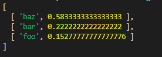

## YouTube adding dynamic functionality Assignment.


#### *** Technologies Used : *** 

```
    1. HTML
    2. CSS
    3. JavaScript
```


#### *** FrontPage Design. ***


#### *** Onclick of Video in the Suggestion list, Rendering the Video *** 


#### *** comment changed. *** 


#### *** Search filter the Videos. The filter providing the Suggestions.*** 


#### *** Suggestion list display based on Accuracy *** 


#### *** Final filter based on Accuracy *** 


#### *** Final result display, based in search. *** 


#### *** Add on Sample Machine learning Algorithm written in JavaScript to search the list of Video, and filter Videos based on highest accuracy, providing the Threshold value. The result in a Array containing the accuracy in descending order. *** 


##### *** Sample code computing Scores. ***
```
 computing the list of similarities
        var sims = []
        for(var doc in this.titles){
            var score = 0.0
            var doc_dict = this.titles[doc][1]
            var key = Object.keys(doc_dict)
            for(var k in query_dict){
                if(key.includes(k)){
                    score += (query_dict[k] / this.corpus_dict[k]) + (doc_dict[k] / this.corpus_dict[k])
                }
            }
            sims.push([this.titles[doc][0], score])
        }
        return sims
    }

```
##### *** Sample Output. ***
